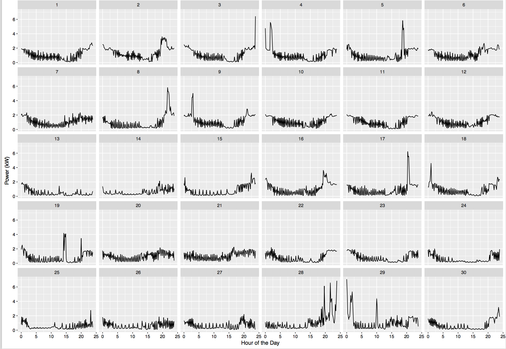
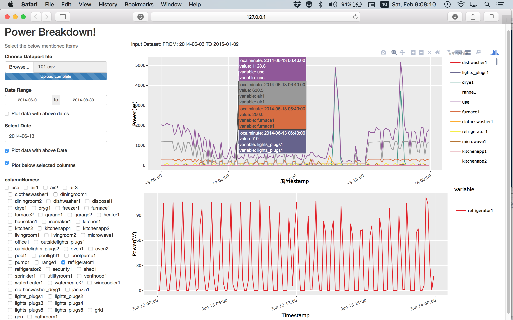

# Ground Truth Marking for the Evaluation of  Rimor 
The ground truth marking for any home is a two-step process. In the first step, aggregate power consumption of a home is plotted day-wise as shown in the following figure 

Each plot of the above figure shows power consumption of a different day of the month. X-axis shows time in hours and Y-axis shows power consumption in Killowatts. Similary, day-wise plots of weather (temperature and humidity) during the same duration are plotted. While visualizing all plots (power, weather) at the same time, days for which power consumption does not seem normal are selected for the next step. In the second step, power consumption of such days is analyzed in a detailed manner with our other R application known as "PowerViz". Now, let's us understand what PowerViz is and how it is used.

## PowerViz

PowerViz is a visualiztion application. It shows aggregate and appliance wise power consumption of a selected home. We built PowerViz using opne source R shiny package.
A screen shot of running PowerViz is shown as  follows

PowerViz has following features:

1. It allows plotting of a single day or a range of days (options provided on left panel of the PowerViz)
2. It also shows power consumption of a single target appliance from all N appliances of a home as shown in bottom plot of the above figure. This feature allows to analyze the power consumption signature in detail.
3. It also has Zoom in and out options. Thus it allows to analyze the changing power consumption behaviour at any time of the selected duration.
4. Further, this provides a comparison of  power consnumptions of all appliances at selected timings as shows in the top plot of the above figure.

Using PowerViz in the second step of ground truth marking, the anomalous instances idenfied in first step were either dropped or marked as anomalous finally. Following rules were used to idenfity anomalous appliances

1. During the anomalous duration, identify the appliance which resulted in deviation. The appliances is identifed by comparing the change in aggregate consumption with other appliance's consumptions
2. See if the selected appliance has been used in the past days (recent three weaks) at the same time of the day. Also, see the duration for which the appliance has been used in the past days. If either the appliance has not been used in the past at the time of current day or if the appliance has not been used for longer duration, then the appliance's usage is marked as anomalous.

